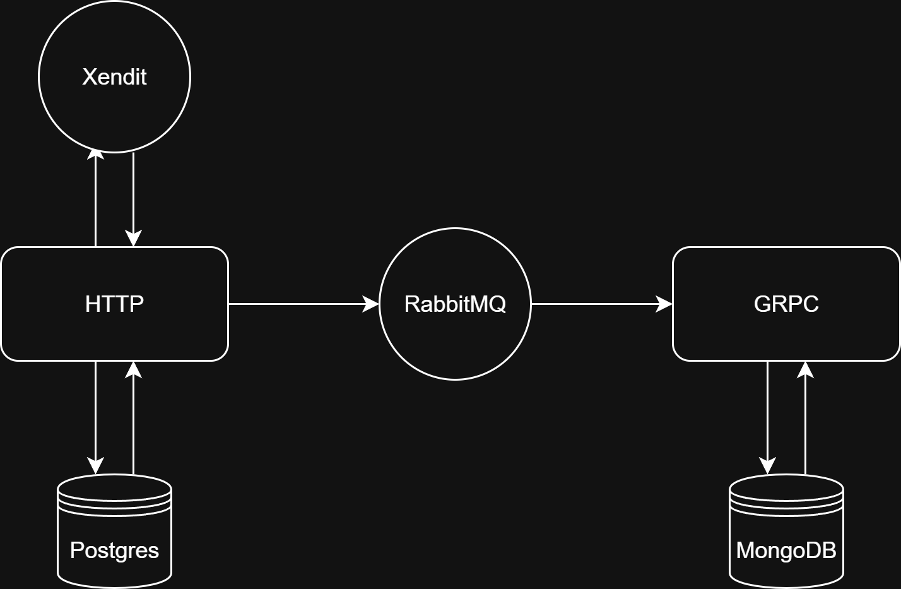
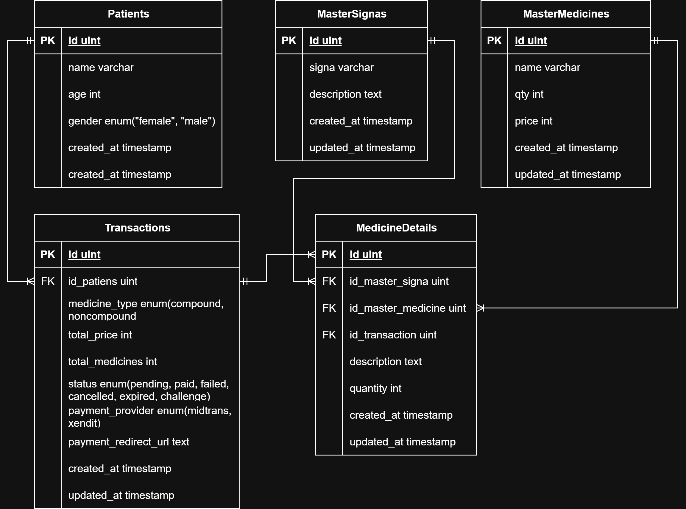
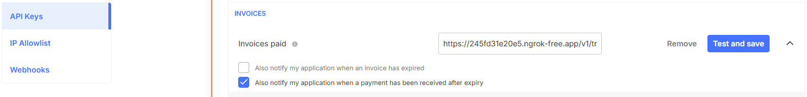

# 💊 Go E-Prescription (Clean Architecture)

Based on [evrone/go-clean-template](https://github.com/evrone/go-clean-template)  

---

## 🏗️ APP Design


---

## 🔌 Communication Patterns

- **HTTP (REST API)** → Main entrypoint for CRUD (Signa, Medicine, Patient, Transaction, Medicine Detail)  
- **gRPC** → Currently only `AuditService` for fetching audit logs  
- **RabbitMQ** → Asynchronous messaging (`transaction.event`)  
- **Payment Gateway** → Integrated with **Xendit** (Invoice & Callback handling)  

---

## 🗄️ Postgres ERD


---

## 🚪 Available Endpoints

### 🌐 HTTP (REST API)
- **Signa**
  - `POST /v1/signas` → Create a signa
  - `GET /v1/signas/:id` → Get a signa by id
  - `GET /v1/signas` → Get all signas
  - `PATCH /v1/signas/:id` → Update a signa
  - `DELETE /v1/signas/:id` → Delete a signa

- **Medicine**
  - `POST /v1/medicines` → Create a medicine
  - `GET /v1/medicines/:id` → Get a medicine by id
  - `GET /v1/medicines` → Get all medicines
  - `PATCH /v1/medicines/:id` → Update a medicine
  - `DELETE /v1/medicines/:id` → Delete a medicine

- **Transaction**
  - `POST /v1/transactions` → Create a transaction
  - `POST /v1/transactions/xendit/callbacks` → Callbacks for xendit payment
  - `GET /v1/transactions/:id` → Get a transaction by id
  - `GET /v1/transactions` → Get all transactions
  - `GET /v1/transactions/patient/:patient_id` → Get transactions by patient id
  - `PATCH /v1/transactions/:id` → Update a transaction
  - `DELETE /v1/transactions/:id` → Delete a transaction

- **Patient**
  - `POST /v1/patients` → Create a patient
  - `GET /v1/patients/:id` → Get a patient by id
  - `GET /v1/patients` → Get all patients
  - `PATCH /v1/patients/:id` → Update a patient
  - `DELETE /v1/patients/:id` → Delete a patient

- **Medicine Detail**
  - `POST /v1/medicine-details` → Create a medicine detail
  - `GET /v1/medicine-details/:id` → Get a medicine detail by id
  - `GET /v1/medicine-details` → Get all medicine details
  - `PATCH /v1/medicine-details/:id` → Update a medicine detail
  - `DELETE /v1/medicine-details/:id` → Delete a medicine detail

---

### 🔌 gRPC
- **AuditService**
  - `GetAllAuditLogs(GetLogRequest) return (GetLogResponse)`

### 🐰 RabbitMQ
- **Handler**
  - `transaction.event`

---

## 👨‍💻 Developer Notes
- Follow **Clean Architecture principles** (delivery → usecase → repository → entity)  
- Database split:  
  - **Postgres** → transactional data (patients, medicines, transactions, signa)  
  - **MongoDB** → audit logs (currently only transaction created and updated)  
- Message-driven architecture using **RabbitMQ**  
- Payment integration with **Xendit**


## 🚀 How to Run (Locally)

1. Make sure **rabbitmq** is running first (using docker recommended)
2. Expose http url using **ngrok**/whatever to get callback from payment gateway
3. Database is created first (both **postgres** and **mongodb**)
4. Set callback endpoint in **xendit**
 

```bash
# Run app
go run cmd/app/main.go

# Run app with hot reload (air)
air

# Ngrok command
ngrok http http://localhost:8080

# Some command for swagger, database, or protobuf available on Makefile
make help

```

## 📝 Notes
- 🌍 Use **ngrok** to expose API publicly  
- 🚫 Swagger **cannot be used on public URL (ngrok)** → can open Swagger UI but API won’t respond → use **Postman** instead (import the YAML)  
- 💳 Midtrans payment **notification URL** cannot use ngrok public URL  

---

## ✅ What To Do
- 🧪 Add **Unit Tests**  
- 🔄 Setup **CI/CD pipeline**  
- 📦 Add Dockerfile & docker-compose for easier deployment  